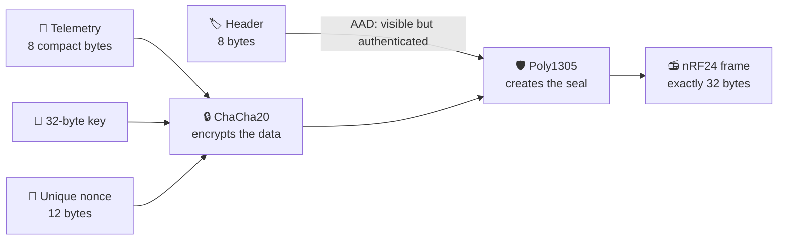
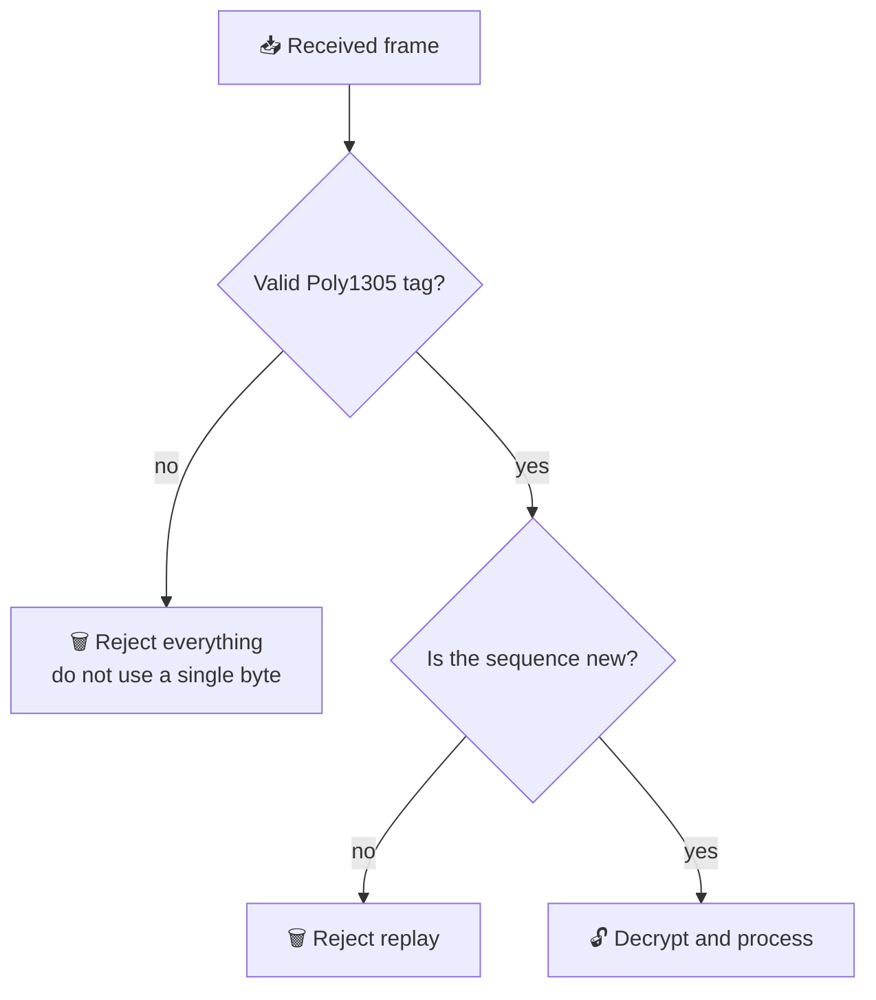
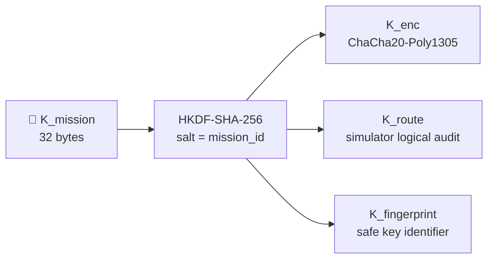
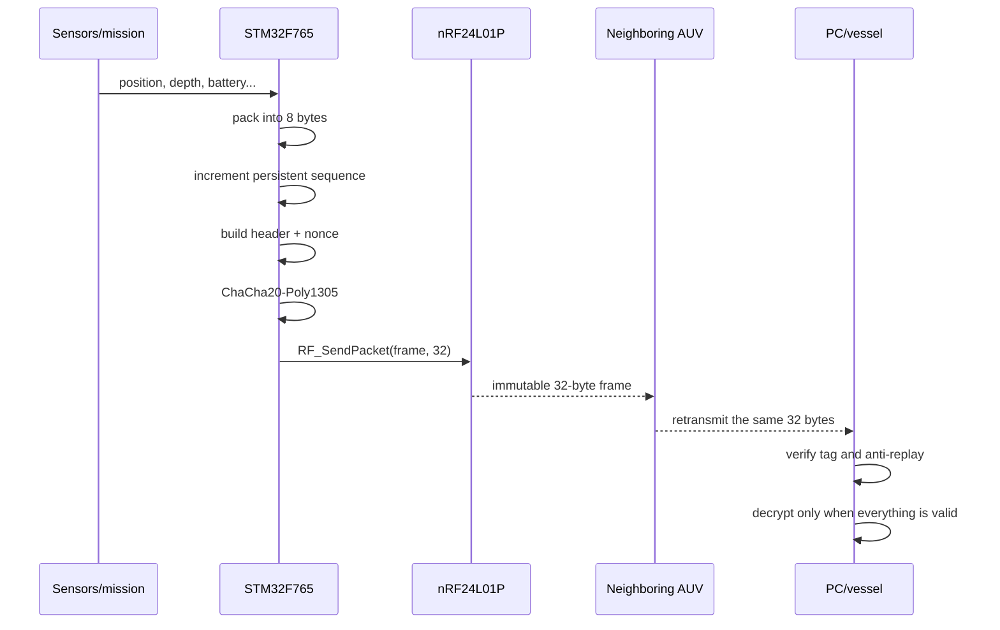

# Caiman Cryptography — explained with no cryptography background required

> **Purpose:** explain exactly how Caiman intends to protect packets exchanged between the five AUVs and the survey vessel, while clearly separating what already works in the simulator from what still needs to be implemented on the STM32.

**Technical review:** July 17, 2026 · analyzed hardware: STM32F765VIT7 + nRF24L01P.

## 30-second summary

The correct name of the main protection mechanism is **ChaCha20-Poly1305**.

Think of every message as a box:

- **ChaCha20** closes the box behind a curtain: anyone intercepting it sees meaningless bytes.
- **Poly1305** adds a tamper-evident seal: if even one bit changes, the receiver rejects everything.
- The **nonce** is the box's unique serial number. It must never repeat under the same key.
- The **header** is the external label: source, destination, sequence, and fragment.
- **HKDF-SHA-256** takes one master key and produces separate keys for different purposes.
- The **anti-replay window** prevents someone from recording a valid packet and transmitting it again later.



### Honest verdict

| Question | Answer |
|---|---|
| Does the format fit the nRF24L01P? | ✅ Yes: every frame is exactly 32 bytes. |
| Can the STM32F765 execute the algorithm? | ✅ Yes, with ample memory and a software implementation. |
| Does the current driver send and receive 32 bytes? | ✅ Yes. |
| Is cryptography already integrated into the current firmware? | ❌ No. It exists in the Python simulator, but not yet in the STM32 C code. |
| Is it correct to call the current system “hardware-encrypted”? | ❌ Not yet. The accurate description is **“compatible by design, pending firmware integration and validation.”** |

---

## 1. First: four words that confuse almost everyone

| Word | Plain-language meaning | In Caiman |
|---|---|---|
| **Plaintext** | The original readable data | position, depth, battery, etc. |
| **Ciphertext** | Data scrambled by the cipher | 8 apparently random bytes |
| **Key** | A shared secret | 32 bytes, never sent over the radio |
| **Nonce** | A unique number for each transmission | mission + robot + sequence + fragment |

A cipher that only hides data is not enough. An attacker could modify the ciphertext and cause unpredictable changes. This is why we use an **AEAD** (*Authenticated Encryption with Associated Data*): it hides the data **and** detects tampering.

[RFC 8439](https://www.rfc-editor.org/rfc/rfc8439.html) standardizes ChaCha20-Poly1305 with:

- a 256-bit key = **32 bytes**;
- a 96-bit nonce = **12 bytes**;
- a 128-bit authentication tag = **16 bytes**.

## 2. What each component does

### 2.1 ChaCha20: the curtain

ChaCha20 produces a pseudorandom stream from the key and nonce. This stream is combined with the data using XOR.

```text
original data       13 49 1d 7b 23 af 6b ec
ChaCha20 stream XOR b4 16 4b ba 25 50 b4 23
                    --------------------------------
ciphertext          a7 5f 56 c1 06 ff df cf
```

Without the correct key, reconstructing the original data is not computationally practical.

> ChaCha20 mainly uses 32-bit integer addition, XOR, and rotations. These operations are a very good match for a 32-bit Arm Cortex-M7.

### 2.2 Poly1305: the seal

Poly1305 calculates a 16-byte tag using:

- the visible header;
- the ciphertext;
- the same AEAD operation and session key.

If someone changes the source, destination, sequence, fragment, encrypted content, or tag, verification fails.



The nRF24's two-byte CRC remains enabled, but it detects accidental radio errors. **A CRC does not protect against an attacker** and does not replace Poly1305.

### 2.3 AAD: a visible but protected label

AAD means “Additional Authenticated Data.” It is not secret, but it cannot be changed without invalidating the tag.

In the physical frame, the first 8 bytes are AAD:

- version and message type;
- source;
- destination;
- sequence;
- fragment number;
- number of valid bytes.

The radio and router can read the label, but they cannot alter it silently.

### 2.4 Nonce: the most important rule in the entire system

The nonce **does not have to be secret**, but it must be unique for every use of the same key.

```text
┌──────────────────┬──────────────┬──────────────────┬──────────┐
│ Mission prefix   │ Source ID    │ Message sequence │ Fragment │
│     4 bytes      │   2 bytes    │     5 bytes      │  1 byte  │
└──────────────────┴──────────────┴──────────────────┴──────────┘
                         total = 12 bytes
```

Example:

```text
prefix = a1 b2 c3 d4
source = 00 02                  (R2)
seq    = 00 00 00 00 07         (message 7)
frag   = 00                      (first fragment)

nonce  = a1 b2 c3 d4 00 02 00 00 00 00 07 00
```

If the STM32 restarts and reuses the same nonce with the same key, ChaCha20-Poly1305 security can fail catastrophically. RFC 8439 explicitly requires a different nonce for every invocation under the same key.

**The counter must therefore survive resets, brownouts, and battery replacement.**

Recommended solution:

1. keep the current counter in RAM during operation;
2. reserve sequence ranges in Flash ahead of time, for example 4096 values at once;
3. after a restart, begin at the start of the next reserved range, even if some values were never used;
4. use two Flash pages containing a version, counter, and CRC so a power failure during a write cannot corrupt the only copy;
5. rotate the key and mission prefix before `seq = 0xFFFFFF`, because the physical header uses 24 bits;
6. never “reset the counter for an easier test” while retaining the same key and prefix.

## 3. How the key is created

In the simulator, the PC creates a random 32-byte master key:

```text
K_mission = 32 random bytes
```

HKDF-SHA-256 derives independent keys. [RFC 5869](https://www.rfc-editor.org/rfc/rfc5869.html) calls this process “extract-then-expand.”



Why not use the same key for everything? Because a failure or change in one function should not automatically compromise the others.

In the physical 32-byte frame:

- `K_enc` is the key actually used by the AEAD;
- `K_route` protects the simulator's logical/auditable model but consumes no bytes in the current nRF frame;
- `K_fingerprint` allows the dashboard to display an identifier without revealing the key.

> The `key_id` and mission prefix are not repeated in every radio frame. They belong to the session state provisioned into the nodes. During rotation, the firmware should retain the current and previous keys for a short, controlled grace period.

## 4. The physical 32-byte packet

The nRF24 does not understand ChaCha20. To the radio, the packet is simply a 32-byte array prepared by the STM32.

```text
byte:   0       1       2       3  4  5      6       7       8 ... 15       16 ........ 31
      ┌───────┬───────┬───────┬───────────┬───────┬───────┬───────────────┬─────────────────────┐
      │control│ source│  dest │ sequence  │ frag  │ valid │  ciphertext   │   Poly1305 tag      │
      │  1 B  │  1 B  │  1 B │    3 B    │  1 B │  1 B  │      8 B      │       16 B          │
      └───────┴───────┴───────┴───────────┴───────┴───────┴───────────────┴─────────────────────┘
      └──────────────── header/AAD = 8 B ─────────────────┘

                         8 + 8 + 16 = exactly 32 bytes
```

| Field | Purpose |
|---|---|
| `control` | version (2 bits), type (4), ACK (1), encrypted (1) |
| `source` | `BASE=0`, `R1=1`, ..., `R5=5` |
| `dest` | destination node |
| `sequence` | monotonic 24-bit counter |
| `fragment` | index (4 bits) + count−1 (4 bits) |
| `valid` | useful bytes inside the encrypted block, from 0 to 8 |
| `ciphertext` | compacted and encrypted data block |
| `tag` | full 16-byte authentication tag |

### Efficiency

- application data: 8 bytes;
- nRF frame: 32 bytes;
- gross application-payload efficiency: **25%**;
- the overhead is high but deliberate: the full 128-bit tag is retained.

Shortening the tag merely to gain a few bytes is not recommended. Better compact encoding and avoiding unnecessary messages are the correct ways to improve efficiency.

## 5. How does so much telemetry fit in only 8 bytes?

Common telemetry is packed bit by bit:

| Data | Bits | Resolution | Representable range |
|---|---:|---:|---:|
| East / `x` | 14 | 0.1 m | 0 to 1638.3 m |
| North / `y` | 14 | 0.1 m | 0 to 1638.3 m |
| AUV depth | 11 | 0.01 m | 0 to 20.47 m |
| bottom depth | 11 | 0.01 m | 0 to 20.47 m |
| battery | 8 | 0.5% | 0 to 127.5% — actual values limited to 100% |
| link quality | 4 | 1/15 | 0 to 1 |
| leak | 1 | yes/no | 0 or 1 |
| GNSS available | 1 | yes/no | 0 or 1 |
| **Total** | **64** |  | **8 bytes** |

```text
14 + 14 + 11 + 11 + 8 + 4 + 1 + 1 = 64 bits = 8 bytes
```

This is compatible with the current mission area of roughly 1000 × 700 m and operation down to 20 m. If the maximum depth returns to 30 m, **11 bits at 1 cm resolution will not be enough**. The resolution must change, for example to 2 cm, or the field must grow.

### Larger messages

A larger message is split into 8-byte blocks, with a current limit of 16 fragments:

```text
25-byte message
   ├─ fragment 0: 8 bytes + its own tag
   ├─ fragment 1: 8 bytes + its own tag
   ├─ fragment 2: 8 bytes + its own tag
   └─ fragment 3: 1 valid byte + padding + its own tag
```

Every fragment has its own nonce and tag. The receiver only delivers a message to the application after every valid fragment has been authenticated and reassembled.

> The simulator uses JSON/DEFLATE as a fallback for generic messages. For embedded firmware, fixed binary codecs should be created for each command and alert. This avoids adding JSON and zlib to the STM32 and makes protocol behavior predictable.

## 6. Step-by-step transmission



A relay does not need to understand the content. It retransmits the same 32 bytes and maintains a `(source, sequence, fragment)` cache to prevent loops.

## 7. Complete reproducible example

Educational parameters:

```text
mission_id = CAIMAN-DEMO
K_mission = 00 01 02 ... 1f
K_enc     = 8b 42 80 62 b1 51 ee 60 cd 7d cd 3c fc a7 58 2c
            b2 69 29 62 87 ed a0 2b 73 08 31 47 1a b5 12 ef
prefix    = a1 b2 c3 d4
source    = R2
dest      = BASE
sequence  = 7
fragment  = 0
```

Compacted telemetry:

```text
13 49 1d 7b 23 af 6b ec
```

Final frame:

```text
header      41 02 00 00 00 07 00 08
ciphertext  a7 5f 56 c1 06 ff df cf
tag         d1 80 d6 95 07 6e 11 fe 45 67 a2 08 62 18 12 fa

frame       41 02 00 00 00 07 00 08
            a7 5f 56 c1 06 ff df cf
            d1 80 d6 95 07 6e 11 fe 45 67 a2 08 62 18 12 fa
```

This vector was generated by the simulator's current codec and should become a **byte-for-byte** test in the C firmware. If the STM32 produces any different byte from the same inputs, the implementations are not yet compatible.

## 8. Real-hardware compatibility

### 8.1 STM32F765VIT7

The `firmware.ioc` file identifies the MCU as an `STM32F765VIT7`. The [official ST product page](https://www.st.com/content/st_com/en/products/microcontrollers-microprocessors/stm32-32-bit-arm-cortex-mcus/stm32-high-performance-mcus/stm32f7-series/stm32f7x5/stm32f765vi.html) specifies a Cortex-M7 running at up to 216 MHz, up to 2 MB of Flash, 512 KB of SRAM, and a true random-number generator.

| Requirement | Current hardware/project | Result |
|---|---|---|
| ChaCha20 32-bit operations | 32-bit Cortex-M7 | ✅ suitable |
| library and buffer memory | 2 MB Flash / 512 KB RAM in the linker | ✅ ample margin |
| randomness | RNG peripheral initialized | ✅ available |
| compatible library | STCryptoLib provides software ChaCha20-Poly1305 and HKDF | ✅ available |
| counter storage | Flash available | ⚠️ crash-safe logic still absent |
| C integration | no ChaCha/Poly1305/HKDF in the current CMake project | ❌ pending |

The [official STM32 cryptographic-library documentation](https://www.st.com/resource/en/user_manual/dm00215061-stm32-crypto-library-stmicroelectronics.pdf) states that ChaCha20-Poly1305 and HKDF can run in software across STM32 series. A new integration should use the current [X-CUBE-CRYPTOLIB](https://www.st.com/en/embedded-software/x-cube-cryptolib.html), rather than copying homemade cryptographic code.

#### Pay attention to the real clock frequency

Although the chip supports up to 216 MHz, the current `SystemClock_Config()` selects HSI directly as `SYSCLK`. The current firmware therefore operates at approximately **16 MHz**, not 216 MHz. This should still be sufficient for small packets and telemetry intervals measured in seconds, but actual cipher latency must be measured on the hardware.

### 8.2 nRF24L01P

The [official nRF24L01+ specification](https://docs-be.nordicsemi.com/bundle/nRF24L01P_PS_v1.0/raw/resource/enus/nRF24L01P_PS_v1.0.pdf) defines payloads up to 32 bytes, SPI, and Auto Acknowledgement. The current Caiman driver configures:

| Item | Current configuration | Compatibility |
|---|---|---|
| SPI | SPI1, 8-bit, approximately 8 Mbit/s | ✅ |
| RX width | `RX_PW_P0 = 32` | ✅ |
| transmission | always writes 32 bytes | ✅ |
| reception | consumes all 32 FIFO bytes | ✅ |
| radio rate | `RF_SETUP = 0x06`, 1 Mbit/s | ✅ |
| radio CRC | two bytes enabled | ✅, but does not replace AEAD |
| Auto-ACK | enabled on pipe 0 | ✅ |
| cryptography | performed by the STM32, not the radio | ⚠️ still absent |

At 8 Mbit/s, transferring 32 bytes over SPI takes a theoretical minimum of approximately **32 µs**, excluding commands and control. The 32 payload bytes alone take **256 µs** over a 1 Mbit/s air link, before radio overhead and retransmissions. Therefore, the main constraints are protocol behavior, collisions, retries, and surface-only RF—not the computational size of the cipher.

### 8.3 Water

ChaCha20 does not change physics. The nRF24 operates at 2.4 GHz, and the project model treats the link as unavailable while a robot is submerged. Cryptography protects the content **when communication exists**; it does not create an underwater radio link.

## 9. What the protocol protects—and what it does not

| Situation | Protected? | Reason |
|---|---|---|
| someone listens to the radio | ✅ | they see ciphertext |
| someone changes one bit | ✅ | the Poly1305 tag fails |
| someone repeats an old packet | ✅, if anti-replay state is persistent | sequence/window detects it |
| channel noise | ✅ | CRC + tag + Auto-ACK |
| a jammer blocks 2.4 GHz | ❌ | cryptography cannot stop interference |
| a legitimate AUV is physically captured | partially | the group key may be extracted without added protection |
| cryptographically distinguish R1 from R2 | ❌ with a group key | any member knowing the key can forge another ID |
| underwater communication | ❌ | physical RF limitation |

### Group-key limitation

All five AUVs share `K_mission`. This is simple and well suited to the mesh, but it means a compromised robot can create packets that appear to come from another robot.

For an initial academic version, the group key is acceptable if this limitation is documented. If individual identity becomes a requirement, every robot will need its own key or a per-source signature/MAC in addition to the mesh key.

## 10. The simulator's two layers

The project has two representations, and confusing them causes mistakes:

| Layer | Purpose | Sent through nRF? |
|---|---|---|
| Python logical envelope | rich audit data, JSON, route tests, HMAC, dashboard | ❌ |
| compact physical frame | actual 32-byte contract | ✅ |

The firmware must reproduce `compact_protocol.py`; it must not serialize the large logical object from `packets.py`.

## 11. Minimum STM32 implementation contract

Simplified transmission flow:

```c
uint8_t frame[32];
uint8_t header[8];
uint8_t plaintext[8];
uint8_t nonce[12];

pack_telemetry(plaintext, telemetry);
reserve_and_increment_sequence(&seq);       // persistent across resets
build_header(header, src, dst, seq, 0, 1, 8);
build_nonce(nonce, mission_prefix, src, seq, 0);

chacha20_poly1305_encrypt(
    K_enc,
    nonce,
    header, 8,                            // AAD
    plaintext, 8,
    &frame[8],                            // ciphertext
    &frame[16]                            // 16-byte tag
);

memcpy(&frame[0], header, 8);
RF_SendPacket(frame, 32);
```

Reception flow:

```text
1. Read exactly 32 bytes.
2. Validate version, IDs, fragment count, and fragment index.
3. Reconstruct the nonce from mission state.
4. Verify Poly1305 in constant time.
5. On failure: discard without exposing the plaintext.
6. Check replay state using (source, sequence, fragment).
7. Decrypt and copy only the byte count given by “valid.”
8. Reassemble fragments with a timeout and bounded memory.
9. Only then deliver the complete message to the mission logic.
```

## 12. Checklist before claiming “hardware compatible”

Items marked ⬜ still need to be completed:

- ✅ the nRF driver detects the radio;
- ✅ 8-bit SPI;
- ✅ fixed 32-byte TX/RX;
- ✅ nRF Auto-ACK and retries;
- ✅ 32-byte format defined in the simulator;
- ✅ Python tests for size, tampering, replay, and immutable forwarding;
- ⬜ integrate X-CUBE-CRYPTOLIB or another reviewed C library;
- ⬜ implement HKDF-SHA-256 identically to Python;
- ⬜ implement binary codecs for every message type;
- ⬜ implement fragmentation/reassembly;
- ⬜ implement relay cache `(src, seq, frag)`;
- ⬜ implement a crash-safe monotonic counter in Flash;
- ⬜ define `K_mission` provisioning and protection;
- ⬜ implement rotation using current + previous keys;
- ⬜ reproduce this document's hexadecimal vector on the STM32;
- ⬜ test changes to every bit in the header, ciphertext, and tag;
- ⬜ test reset/brownout without nonce reuse;
- ⬜ measure cycles, stack, and Flash under the real 16 MHz configuration;
- ⬜ test two physical boards and capture the exchange with a logic analyzer;
- ⬜ test loss, missing fragments, duplicates, and out-of-order delivery.

Only after these tests is the following statement accurate: **“The protocol is implemented and validated end to end on STM32F765 + nRF24L01P.”**

## 13. Questions likely to come up during a presentation

### “Why ChaCha20-Poly1305 instead of only AES?”

ChaCha20-Poly1305 already combines confidentiality and authentication, is standardized, works very well on 32-bit CPUs, and has an official STM32 implementation. AES-GCM could also work, but changing the algorithm would not eliminate the need for a nonce, tag, anti-replay protection, and testing.

### “Is the key included in the packet?”

No. The key must be provisioned before the mission. Sending the key with the packet would be like taping the padlock key to the box.

### “Is the nonce another key?”

No. It may be public. Its requirement is uniqueness.

### “Why spend half the packet on the tag?”

The tag prevents silent modification. The nRF has a small payload, but security cannot rely only on the radio CRC.

### “Does a relay need to decrypt the message?”

No. It retransmits the immutable frame. Only the destination needs to authenticate and decrypt it.

### “What happens if one fragment is lost?”

The message is not delivered. The receiver waits until a timeout and requests or requires retransmission according to application policy.

### “So, is it finished?”

The **design is compatible**, and the simulator produces correctly sized frames. The **cryptographic firmware still needs to be implemented and tested**.

## Primary sources

- [RFC 8439 — ChaCha20 and Poly1305 for IETF Protocols](https://www.rfc-editor.org/rfc/rfc8439.html)
- [RFC 5869 — HKDF](https://www.rfc-editor.org/rfc/rfc5869.html)
- [ST — STM32F765VI](https://www.st.com/content/st_com/en/products/microcontrollers-microprocessors/stm32-32-bit-arm-cortex-mcus/stm32-high-performance-mcus/stm32f7-series/stm32f7x5/stm32f765vi.html)
- [ST — X-CUBE-CRYPTOLIB](https://www.st.com/en/embedded-software/x-cube-cryptolib.html)
- [ST — ChaCha20-Poly1305 documentation](https://dev.st.com/stm32cube-docs/mw-stcryptolib/2.0.0/en/docs/markup/mw_drivers/cipher_drivers/cipher/cmox_chachapoly.html)
- [Nordic — nRF24L01+ Product Specification](https://docs-be.nordicsemi.com/bundle/nRF24L01P_PS_v1.0/raw/resource/enus/nRF24L01P_PS_v1.0.pdf)

## Project files used in this analysis

- `simulator/caiman_sim/crypto_layer.py`
- `simulator/caiman_sim/compact_protocol.py`
- `simulator/caiman_sim/packets.py`
- `simulator/tests/test_crypto.py`
- `simulator/tests/test_compact_protocol.py`
- `firmware/firmware.ioc`
- `firmware/Core/Src/main.c`
- `firmware/Core/Src/drivers/rf_comm.c`
- `firmware/STM32F765XX_FLASH.ld`
