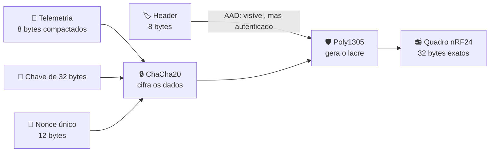
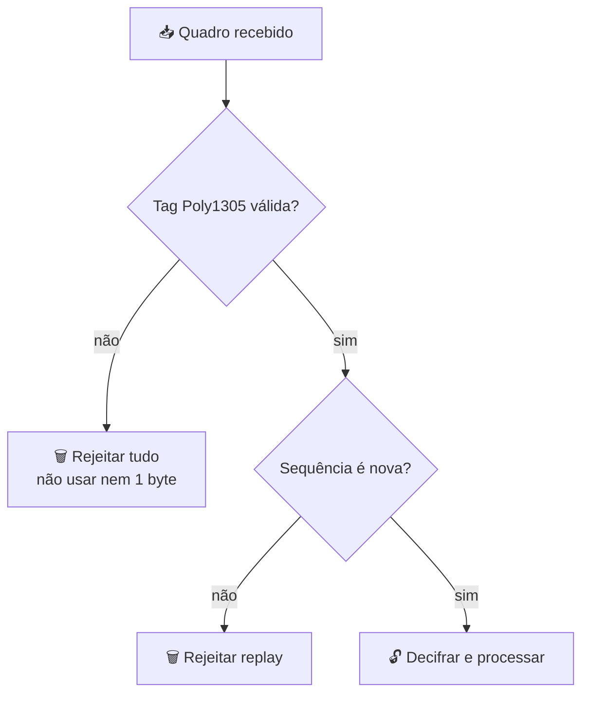
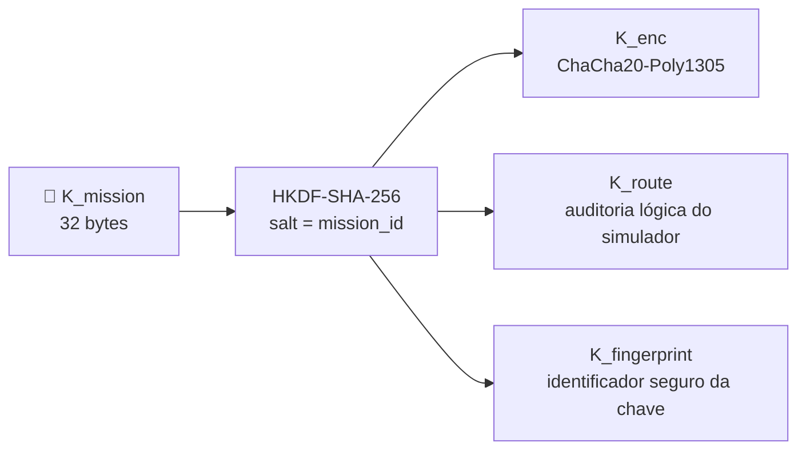
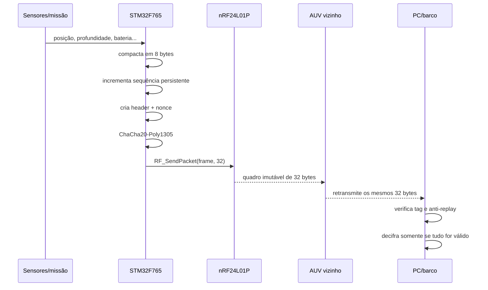

# Criptografia do Caiman — explicada sem pressupor conhecimento de criptografia

> **Objetivo:** explicar exatamente como o Caiman pretende proteger os pacotes enviados entre os cinco AUVs e o barco, e separar claramente o que já funciona no simulador do que ainda precisa ser implementado no STM32.

**Revisão técnica:** 17 de julho de 2026 · hardware analisado: STM32F765VIT7 + nRF24L01P.

## Resumo em 30 segundos

O nome correto da proteção principal é **ChaCha20-Poly1305**.

Pense em cada mensagem como uma caixa:

- **ChaCha20** fecha a caixa com uma cortina: quem intercepta vê bytes sem sentido.
- **Poly1305** coloca um lacre inviolável: se um único bit mudar, o receptor rejeita tudo.
- O **nonce** é o número de série único da caixa. Ele nunca pode se repetir com a mesma chave.
- O **header** é a etiqueta externa: origem, destino, sequência e fragmento.
- **HKDF-SHA-256** pega uma chave-mestra e fabrica chaves separadas para usos diferentes.
- A janela de **anti-replay** impede alguém de gravar um pacote válido e transmiti-lo novamente depois.



### Veredito honesto

| Pergunta | Resposta |
|---|---|
| O formato cabe no nRF24L01P? | ✅ Sim: cada quadro tem exatamente 32 bytes. |
| O STM32F765 consegue executar o algoritmo? | ✅ Sim, com grande margem de memória e uma implementação em software. |
| O driver atual envia e recebe 32 bytes? | ✅ Sim. |
| A criptografia já está integrada ao firmware atual? | ❌ Não. Ela existe no simulador Python, mas ainda não no código C do STM32. |
| É correto chamar o sistema atual de “hardware criptografado”? | ❌ Ainda não. O correto hoje é **“protocolo compatível por projeto, pendente de integração e validação no firmware”**. |

---

## 1. Antes de tudo: quatro palavras que confundem todo mundo

| Palavra | Tradução humana | No Caiman |
|---|---|---|
| **Plaintext** | Dado original legível | posição, profundidade, bateria etc. |
| **Ciphertext** | Dado embaralhado pela cifra | 8 bytes que parecem aleatórios |
| **Chave** | Segredo compartilhado | 32 bytes, nunca enviados pelo rádio |
| **Nonce** | Número único por transmissão | missão + robô + sequência + fragmento |

Uma cifra que apenas esconde dados não é suficiente. Um atacante poderia alterar o ciphertext e causar alterações imprevisíveis. Por isso usamos uma **AEAD** (*Authenticated Encryption with Associated Data*): ela esconde os dados **e** detecta adulteração.

O [RFC 8439](https://www.rfc-editor.org/rfc/rfc8439.html) padroniza ChaCha20-Poly1305 com:

- chave de 256 bits = **32 bytes**;
- nonce de 96 bits = **12 bytes**;
- tag de autenticação de 128 bits = **16 bytes**.

## 2. O que cada peça faz

### 2.1 ChaCha20: a cortina

ChaCha20 produz uma sequência pseudoaleatória a partir da chave e do nonce. Essa sequência é combinada com os dados usando XOR.

```text
dados originais    13 49 1d 7b 23 af 6b ec
fluxo ChaCha20  XOR b4 16 4b ba 25 50 b4 23
                 --------------------------------
ciphertext          b7 5f 56 c1 06 ff df cf
```

Sem a chave correta, não é viável reconstruir os dados originais.

> ChaCha20 usa principalmente soma de inteiros de 32 bits, XOR e rotações. Isso combina muito bem com um ARM Cortex-M7 de 32 bits.

### 2.2 Poly1305: o lacre

Poly1305 calcula uma tag de 16 bytes usando:

- o header visível;
- o ciphertext;
- a mesma operação AEAD e chave de sessão.

Se alguém mudar origem, destino, sequência, fragmento, conteúdo cifrado ou tag, a verificação falha.



O CRC de 2 bytes do nRF24 continua habilitado, mas ele serve para detectar erros acidentais do rádio. **CRC não é proteção contra atacante** e não substitui Poly1305.

### 2.3 AAD: etiqueta visível, porém protegida

AAD significa “dado associado autenticado”. Ele não é secreto, mas não pode ser alterado sem invalidar a tag.

No quadro físico, os primeiros 8 bytes são AAD:

- versão e tipo;
- origem;
- destino;
- sequência;
- número do fragmento;
- quantidade de bytes válidos.

O rádio e o roteador conseguem ler a etiqueta, mas não conseguem adulterá-la silenciosamente.

### 2.4 Nonce: a regra mais importante de todo o sistema

O nonce **não precisa ser secreto**, mas deve ser único para cada uso da mesma chave.

```text
┌──────────────────┬──────────────┬──────────────────────┬───────────┐
│ Prefixo da missão│ ID da origem │ Sequência da mensagem│ Fragmento │
│     4 bytes      │   2 bytes    │       5 bytes        │  1 byte   │
└──────────────────┴──────────────┴──────────────────────┴───────────┘
                         total = 12 bytes
```

Exemplo:

```text
prefixo = a1 b2 c3 d4
origem  = 00 02                  (R2)
seq     = 00 00 00 00 07         (mensagem 7)
frag    = 00                      (primeiro fragmento)

nonce   = a1 b2 c3 d4 00 02 00 00 00 00 07 00
```

Se o STM32 reiniciar e reutilizar o mesmo nonce com a mesma chave, a segurança de ChaCha20-Poly1305 pode quebrar gravemente. O RFC 8439 é explícito: o nonce deve ser diferente em cada invocação com a mesma chave.

**Portanto, o contador deve sobreviver a reset, brownout e troca de bateria.**

Solução recomendada:

1. manter o contador atual em RAM durante a operação;
2. reservar antecipadamente blocos de sequências em Flash, por exemplo 4096 por vez;
3. após reiniciar, começar no início do próximo bloco reservado, mesmo que algumas sequências tenham ficado sem uso;
4. usar duas páginas de Flash com versão, contador e CRC para tolerar queda de energia no meio da gravação;
5. rotacionar chave e prefixo da missão antes de `seq = 0xFFFFFF`, pois o header físico usa 24 bits;
6. nunca “zerar para facilitar um teste” mantendo a mesma chave e o mesmo prefixo.

## 3. Como nasce a chave

No simulador, o PC cria uma chave-mestra aleatória de 32 bytes:

```text
K_mission = 32 bytes aleatórios
```

HKDF-SHA-256 deriva chaves independentes. O [RFC 5869](https://www.rfc-editor.org/rfc/rfc5869.html) chama esse processo de “extract-then-expand”.



Por que não usar a mesma chave para tudo? Porque uma falha ou mudança em uma função não deve comprometer automaticamente as outras.

No quadro físico de 32 bytes:

- `K_enc` é a chave realmente usada pela AEAD;
- `K_route` protege o modelo lógico/auditável do simulador, mas não ocupa bytes no quadro nRF atual;
- `K_fingerprint` permite mostrar um identificador na dashboard sem revelar a chave.

> O `key_id` e o prefixo da missão não são repetidos em cada quadro de rádio. Eles fazem parte do estado de sessão provisionado nos nós. Durante rotação, o firmware deve manter a chave atual e a anterior por uma janela curta e controlada.

## 4. O pacote físico de 32 bytes

O nRF24 não sabe o que é ChaCha20. Para ele, o pacote é apenas um vetor de 32 bytes criado pelo STM32.

```text
byte:   0       1       2       3  4  5      6       7       8 ... 15       16 ........ 31
      ┌───────┬───────┬───────┬───────────┬───────┬───────┬───────────────┬─────────────────────┐
      │control│ source│  dest │ sequence  │ frag  │ valid │  ciphertext   │   Poly1305 tag      │
      │  1 B  │  1 B  │  1 B │    3 B    │  1 B │  1 B  │      8 B      │       16 B          │
      └───────┴───────┴───────┴───────────┴───────┴───────┴───────────────┴─────────────────────┘
      └──────────────── header/AAD = 8 B ─────────────────┘

                         8 + 8 + 16 = 32 bytes exatos
```

| Campo | Função |
|---|---|
| `control` | versão (2 bits), tipo (4), ACK (1), encrypted (1) |
| `source` | `BASE=0`, `R1=1`, ..., `R5=5` |
| `dest` | nó destinatário |
| `sequence` | contador monotônico de 24 bits |
| `fragment` | índice (4 bits) + quantidade−1 (4 bits) |
| `valid` | bytes úteis dentro do bloco cifrado, de 0 a 8 |
| `ciphertext` | bloco de dados compactado e cifrado |
| `tag` | autenticação integral de 16 bytes |

### Eficiência

- aplicação: 8 bytes;
- quadro do nRF: 32 bytes;
- eficiência bruta do payload da aplicação: **25%**;
- custo alto, mas deliberado: mantemos a tag completa de 128 bits.

Não é recomendado encurtar a tag só para ganhar alguns bytes. Para ganhar eficiência, a solução correta é compactar melhor os dados e evitar mensagens desnecessárias.

## 5. Como cabe tanta telemetria em apenas 8 bytes?

A telemetria comum é compactada bit a bit:

| Dado | Bits | Resolução | Faixa representável |
|---|---:|---:|---:|
| East / `x` | 14 | 0,1 m | 0 a 1638,3 m |
| North / `y` | 14 | 0,1 m | 0 a 1638,3 m |
| profundidade do AUV | 11 | 0,01 m | 0 a 20,47 m |
| profundidade do fundo | 11 | 0,01 m | 0 a 20,47 m |
| bateria | 8 | 0,5% | 0 a 127,5% — valores reais limitados a 100% |
| qualidade do link | 4 | 1/15 | 0 a 1 |
| vazamento | 1 | sim/não | 0 ou 1 |
| GNSS disponível | 1 | sim/não | 0 ou 1 |
| **Total** | **64** |  | **8 bytes** |

```text
14 + 14 + 11 + 11 + 8 + 4 + 1 + 1 = 64 bits = 8 bytes
```

Isso é compatível com a missão atual de aproximadamente 1000 × 700 m e operação até 20 m. Se a profundidade máxima voltar a ser 30 m, **os campos de 11 bits a 1 cm não serão suficientes**; será necessário mudar a resolução, por exemplo para 2 cm, ou aumentar o campo.

### Mensagens maiores

Uma mensagem maior é dividida em blocos de 8 bytes, com limite atual de 16 fragmentos:

```text
mensagem de 25 bytes
   ├─ fragmento 0: 8 bytes + tag própria
   ├─ fragmento 1: 8 bytes + tag própria
   ├─ fragmento 2: 8 bytes + tag própria
   └─ fragmento 3: 1 byte válido + padding + tag própria
```

Cada fragmento tem nonce e tag próprios. O receptor só entrega a mensagem à aplicação quando todos os fragmentos válidos foram autenticados e reunidos.

> O simulador usa JSON/DEFLATE como fallback para mensagens genéricas. Para o firmware embarcado, o recomendado é criar codecs binários fixos para cada comando e alerta. Isso elimina a necessidade de colocar JSON e zlib no STM32 e torna o protocolo previsível.

## 6. Passo a passo de uma transmissão



O relay não precisa conhecer o conteúdo. Ele retransmite os mesmos 32 bytes e mantém um cache de `(origem, sequência, fragmento)` para não criar loops.

## 7. Exemplo completo e reproduzível

Parâmetros didáticos:

```text
mission_id = CAIMAN-DEMO
K_mission = 00 01 02 ... 1f
K_enc     = 8b 42 80 62 b1 51 ee 60 cd 7d cd 3c fc a7 58 2c
            b2 69 29 62 87 ed a0 2b 73 08 31 47 1a b5 12 ef
prefixo    = a1 b2 c3 d4
origem     = R2
destino    = BASE
sequência  = 7
fragmento  = 0
```

Telemetria compactada:

```text
13 49 1d 7b 23 af 6b ec
```

Quadro final:

```text
header      41 02 00 00 00 07 00 08
ciphertext  a7 5f 56 c1 06 ff df cf
tag         d1 80 d6 95 07 6e 11 fe 45 67 a2 08 62 18 12 fa

frame       41 02 00 00 00 07 00 08
            a7 5f 56 c1 06 ff df cf
            d1 80 d6 95 07 6e 11 fe 45 67 a2 08 62 18 12 fa
```

Esse vetor foi gerado pelo codec atual do simulador e deve virar um teste **byte por byte** no firmware C. Se o STM32 produzir qualquer byte diferente usando as mesmas entradas, as duas implementações ainda não são compatíveis.

## 8. Compatibilidade com o hardware real

### 8.1 STM32F765VIT7

O arquivo `firmware.ioc` identifica o MCU como `STM32F765VIT7`. A [página oficial da ST](https://www.st.com/content/st_com/en/products/microcontrollers-microprocessors/stm32-32-bit-arm-cortex-mcus/stm32-high-performance-mcus/stm32f7-series/stm32f7x5/stm32f765vi.html) informa Cortex-M7 de até 216 MHz, até 2 MB de Flash, 512 KB de SRAM e RNG verdadeiro.

| Requisito | Hardware/projeto atual | Resultado |
|---|---|---|
| operações de 32 bits do ChaCha20 | Cortex-M7 de 32 bits | ✅ adequado |
| memória para biblioteca e buffers | 2 MB Flash / 512 KB RAM no linker | ✅ margem ampla |
| aleatoriedade | periférico RNG inicializado | ✅ disponível |
| biblioteca compatível | STCryptoLib oferece ChaCha20-Poly1305 e HKDF em software | ✅ existe |
| armazenamento do contador | Flash disponível | ⚠️ lógica crash-safe ainda ausente |
| integração C | nenhum ChaCha/Poly1305/HKDF no CMake atual | ❌ pendente |

A [documentação oficial da biblioteca criptográfica STM32](https://www.st.com/resource/en/user_manual/dm00215061-stm32-crypto-library-stmicroelectronics.pdf) afirma que ChaCha20-Poly1305 e HKDF podem rodar por software em todas as séries STM32. Para uma integração nova, deve-se usar a versão atual [X-CUBE-CRYPTOLIB](https://www.st.com/en/embedded-software/x-cube-cryptolib.html), e não copiar código criptográfico artesanal.

#### Atenção à frequência real

Embora o chip suporte até 216 MHz, o `SystemClock_Config()` atual seleciona HSI diretamente como `SYSCLK`, portanto o firmware atual opera em aproximadamente **16 MHz**, não 216 MHz. Isso ainda deve ser suficiente para pacotes pequenos e telemetria em escala de segundos, mas a latência real da cifra precisa ser medida no hardware.

### 8.2 nRF24L01P

A [especificação oficial do nRF24L01+](https://docs-be.nordicsemi.com/bundle/nRF24L01P_PS_v1.0/raw/resource/enus/nRF24L01P_PS_v1.0.pdf) estabelece payload de até 32 bytes, SPI e Auto Acknowledgement. O driver do Caiman já configura:

| Item | Configuração atual | Compatibilidade |
|---|---|---|
| SPI | SPI1, 8 bits, aproximadamente 8 Mbit/s | ✅ |
| largura RX | `RX_PW_P0 = 32` | ✅ |
| transmissão | sempre escreve 32 bytes | ✅ |
| recepção | consome os 32 bytes do FIFO | ✅ |
| taxa de rádio | `RF_SETUP = 0x06`, 1 Mbit/s | ✅ |
| CRC do rádio | 2 bytes habilitados | ✅, mas não substitui AEAD |
| Auto-ACK | pipe 0 habilitado | ✅ |
| criptografia | feita no STM32, não no rádio | ⚠️ ainda ausente |

Tempo mínimo apenas para transferir 32 bytes pelo SPI a 8 Mbit/s: aproximadamente **32 µs**, sem contar comando e controle. Apenas os 32 bytes de payload no ar a 1 Mbit/s ocupam **256 µs**, antes do overhead do rádio e de retransmissões. Portanto, a limitação dominante não é o tamanho computacional da cifra, mas o protocolo, colisões, retries e o fato de o RF só funcionar na superfície.

### 8.3 Água

ChaCha20 não muda a física: o nRF24 trabalha em 2,4 GHz e o modelo do projeto considera o link indisponível quando o robô está submerso. A criptografia protege o conteúdo **quando há comunicação**; ela não cria comunicação debaixo d'água.

## 9. O que o protocolo protege — e o que não protege

| Situação | Protegido? | Motivo |
|---|---|---|
| alguém escuta o rádio | ✅ | vê ciphertext |
| alguém muda um bit | ✅ | tag Poly1305 falha |
| alguém repete pacote antigo | ✅, se o anti-replay estiver persistente | sequência/janela detecta |
| ruído do canal | ✅ | CRC + tag + Auto-ACK |
| jammer bloqueia 2,4 GHz | ❌ | criptografia não impede interferência |
| um AUV legítimo é fisicamente capturado | parcialmente | a chave de grupo pode ser extraída sem proteção adicional |
| distinguir criptograficamente R1 de R2 | ❌ com chave de grupo | qualquer membro que conheça a chave pode forjar outro ID |
| comunicação submersa | ❌ | limitação física do RF |

### Limitação da chave de grupo

Os cinco AUVs compartilham `K_mission`. Isso é simples e combina com a malha, mas significa que um robô comprometido pode gerar pacotes que parecem vir de outro robô.

Para uma primeira versão acadêmica, a chave de grupo é aceitável se essa limitação for documentada. Se identidade individual se tornar requisito, cada robô precisará de uma chave própria ou assinatura/MAC por origem, além da chave usada pela malha.

## 10. As duas camadas do simulador

O projeto tem duas representações, e misturá-las causa confusão:

| Camada | Para que serve | Vai ao nRF? |
|---|---|---|
| envelope lógico Python | auditoria rica, JSON, testes de rota, HMAC, dashboard | ❌ |
| quadro físico compacto | contrato real de 32 bytes | ✅ |

O firmware deve reproduzir `compact_protocol.py`, não serializar o objeto lógico grande de `packets.py`.

## 11. Contrato mínimo de implementação no STM32

Fluxo simplificado de transmissão:

```c
uint8_t frame[32];
uint8_t header[8];
uint8_t plaintext[8];
uint8_t nonce[12];

pack_telemetry(plaintext, telemetry);
reserve_and_increment_sequence(&seq);       // persistente contra reset
build_header(header, src, dst, seq, 0, 1, 8);
build_nonce(nonce, mission_prefix, src, seq, 0);

chacha20_poly1305_encrypt(
    K_enc,
    nonce,
    header, 8,                            // AAD
    plaintext, 8,
    &frame[8],                            // ciphertext
    &frame[16]                            // tag de 16 bytes
);

memcpy(&frame[0], header, 8);
RF_SendPacket(frame, 32);
```

Fluxo de recepção:

```text
1. Ler exatamente 32 bytes.
2. Validar versão, IDs, contagem e índice de fragmento.
3. Reconstruir o nonce usando o estado da missão.
4. Verificar Poly1305 em tempo constante.
5. Se falhar: descartar sem usar o plaintext.
6. Verificar replay por (origem, sequência, fragmento).
7. Decifrar e copiar somente a quantidade indicada em “valid”.
8. Reunir fragmentos com timeout e limite de memória.
9. Só então entregar a mensagem completa à missão.
```

## 12. Checklist para poder afirmar “compatível no hardware”

Hoje, os itens marcados com ⬜ ainda precisam ser concluídos:

- ✅ driver nRF detecta o rádio;
- ✅ SPI de 8 bits;
- ✅ TX/RX de 32 bytes fixos;
- ✅ Auto-ACK e retry do nRF;
- ✅ formato de 32 bytes definido no simulador;
- ✅ testes Python de tamanho, adulteração, replay e frame imutável;
- ⬜ integrar X-CUBE-CRYPTOLIB ou outra biblioteca C revisada;
- ⬜ implementar HKDF-SHA-256 idêntico ao Python;
- ⬜ implementar codecs binários para todos os tipos de mensagem;
- ⬜ implementar fragmentação/reassembly;
- ⬜ implementar cache de relay `(src, seq, frag)`;
- ⬜ implementar contador monotônico crash-safe em Flash;
- ⬜ definir provisionamento e proteção de `K_mission`;
- ⬜ implementar rotação com chave atual + anterior;
- ⬜ reproduzir no STM32 o vetor hexadecimal deste documento;
- ⬜ testar alteração de cada bit do header, ciphertext e tag;
- ⬜ testar reset/brownout sem repetição de nonce;
- ⬜ medir ciclos, stack e Flash na configuração real de 16 MHz;
- ⬜ fazer teste entre duas placas reais e captura com analisador lógico;
- ⬜ testar perda, fragmento ausente, duplicado e fora de ordem.

Somente após esses testes a frase correta passa a ser: **“o protocolo está implementado e validado de ponta a ponta no STM32F765 + nRF24L01P.”**

## 13. Perguntas que provavelmente aparecerão na apresentação

### “Por que ChaCha20-Poly1305 e não só AES?”

Porque ChaCha20-Poly1305 já combina confidencialidade e autenticação, é padronizado, trabalha muito bem em CPUs de 32 bits e possui implementação oficial disponível para STM32. AES-GCM também poderia funcionar, mas trocar de algoritmo não elimina a necessidade do nonce, tag, anti-replay e testes.

### “A chave vai dentro do pacote?”

Não. A chave deve ser provisionada antes da missão. Enviar a chave junto com o pacote seria como colar a chave do cadeado na própria caixa.

### “O nonce é outra chave?”

Não. Ele pode ser público. Sua obrigação é ser único.

### “Por que gastar metade do pacote com a tag?”

Porque a tag é o que impede alterações silenciosas. O nRF tem pouco payload, mas segurança não pode depender apenas do CRC do rádio.

### “Um relay precisa decifrar?”

Não. Ele retransmite o quadro imutável. Apenas o destino precisa autenticar e decifrar.

### “Se perder um fragmento?”

A mensagem não é entregue. O receptor espera até o timeout e solicita/requer retransmissão conforme a política da aplicação.

### “Então já está pronto?”

O **desenho é compatível** e o simulador produz os quadros corretos. O **firmware criptográfico ainda precisa ser implementado e testado**.

## Fontes primárias

- [RFC 8439 — ChaCha20 and Poly1305 for IETF Protocols](https://www.rfc-editor.org/rfc/rfc8439.html)
- [RFC 5869 — HKDF](https://www.rfc-editor.org/rfc/rfc5869.html)
- [ST — STM32F765VI](https://www.st.com/content/st_com/en/products/microcontrollers-microprocessors/stm32-32-bit-arm-cortex-mcus/stm32-high-performance-mcus/stm32f7-series/stm32f7x5/stm32f765vi.html)
- [ST — X-CUBE-CRYPTOLIB](https://www.st.com/en/embedded-software/x-cube-cryptolib.html)
- [ST — documentação ChaCha20-Poly1305](https://dev.st.com/stm32cube-docs/mw-stcryptolib/2.0.0/en/docs/markup/mw_drivers/cipher_drivers/cipher/cmox_chachapoly.html)
- [Nordic — nRF24L01+ Product Specification](https://docs-be.nordicsemi.com/bundle/nRF24L01P_PS_v1.0/raw/resource/enus/nRF24L01P_PS_v1.0.pdf)

## Arquivos do projeto usados nesta análise

- `simulator/caiman_sim/crypto_layer.py`
- `simulator/caiman_sim/compact_protocol.py`
- `simulator/caiman_sim/packets.py`
- `simulator/tests/test_crypto.py`
- `simulator/tests/test_compact_protocol.py`
- `firmware/firmware.ioc`
- `firmware/Core/Src/main.c`
- `firmware/Core/Src/drivers/rf_comm.c`
- `firmware/STM32F765XX_FLASH.ld`
