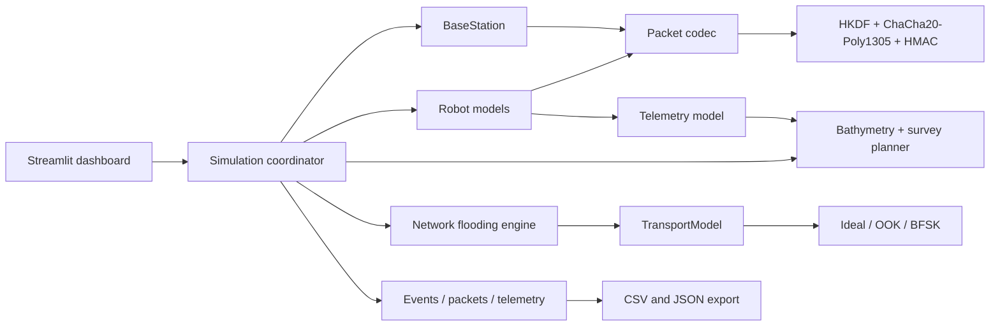
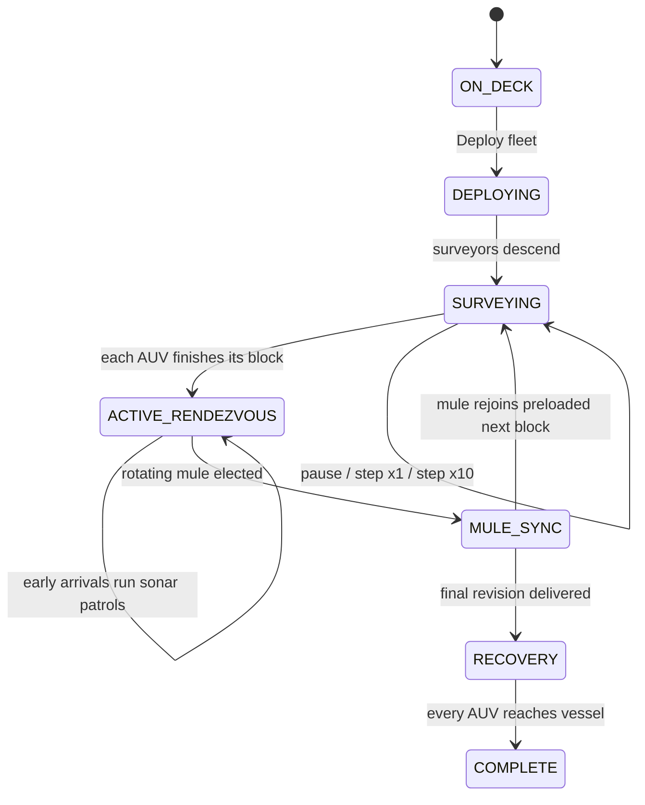
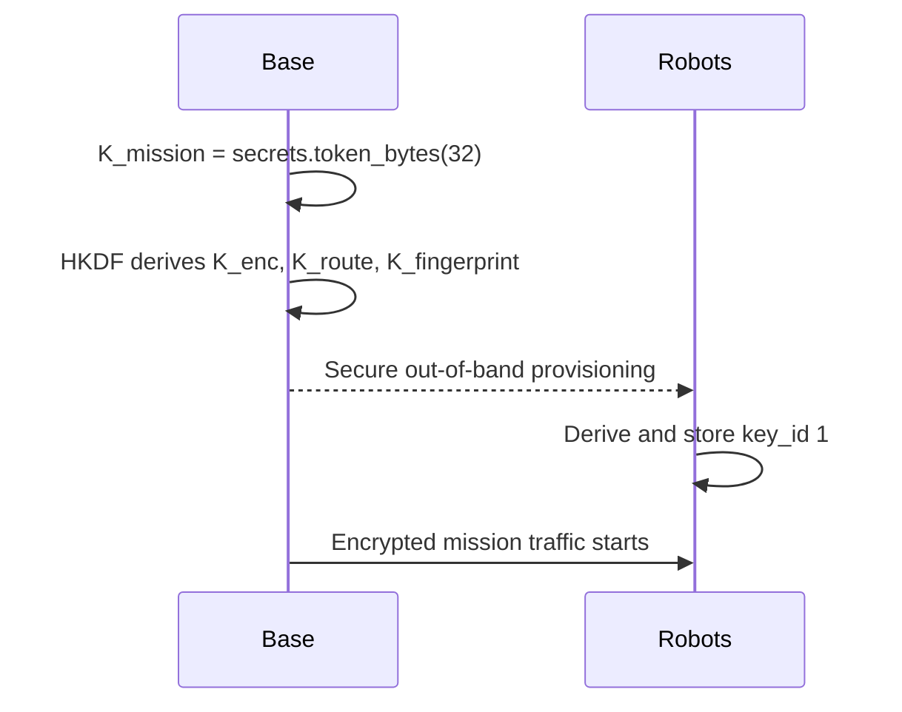
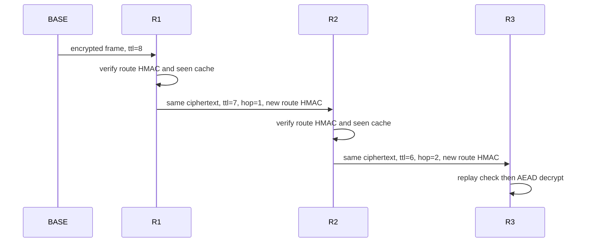

# Caiman Simulator Architecture

## Components



The UI advances a `Simulation` by discrete ticks and reads public snapshot methods. It does not implement a link or crypto operation. `TransportModel` separates delivery behavior from the dashboard and mission model; a serial, UDP, NRF24 or acoustic-modem adapter can implement the same quality, latency and delivery boundary later.

## Bathymetric mission lifecycle



All robot positions initially coincide with the survey vessel at the surface. The default fleet assigns all five vehicles to `SURVEY`; there is no permanent courier. The planner intersects horizontal transects with an irregular coastal polygon and divides them into two wide batches. While submerged, every robot is autonomous and buffers telemetry/map samples locally: `NRF24_SURFACE` returns no neighbors at depths greater than 0.5 m.

Each batch ends near a different edge of the sweep. Early arrivals stay productive on short echosounder loops within RF range. When all have arrived, mule duty rotates deterministically (`R1`, then `R2` in the two-batch default): data is handed off, the other robots immediately start their preloaded next transects, and only the temporary mule visits vessel range before rejoining the survey. The transferred sample snapshot is frozen at handoff, so measurements collected concurrently by the other AUVs cannot appear on the PC early. Recovery performs the final complete offload.

The deterministic seabed combines offshore slope, a shallow channel, a shoal, smooth relief and a deeper basin in a 13–20 m range. Each survey robot follows roughly three metres above the bottom while remaining inside its 10–20 m operating envelope. The Ping-style single-beam footprint uses a 25-degree cone, so its diameter is only about 1.3 m at that altitude. The PC uses inverse-distance weighting over actual track samples to make a reconnaissance contour surface; cells farther than 60 m from a measurement remain unknown. Synced estimates are rendered as labelled one-metre depth contours.

## Provisioning



Every participant has its own `KeyStore`. The initial simulator provisioning directly copies the master key before the mission network starts, representing a trusted wired or manufacturing channel. Only a shortened HMAC-based fingerprint and integer `key_id` reach the UI.

## Packet formats

The current Python representation is canonical JSON plus binary AEAD fields. It maps cleanly to a future packed C structure.

```text
Immutable outer header (AEAD AAD)
  version:u8 | mission_id | key_id:u16 | src_id:u16 | dst_id:u16 | seq:u48

Mutable routing envelope (HMAC-SHA256 with K_route)
  packet_id | previous_hop | ttl:u8 | initial_ttl:u8 | hop_count:u8 | path
  ciphertext_hash | route_mac:32 bytes

Protected payload (ChaCha20-Poly1305 with K_enc)
  nonce:12 bytes | ciphertext | authentication_tag:16 bytes
  plaintext = {message_type, created_at, payload, ack_for}
```

The Python logical representation remains useful for audit and attack tests. In parallel, every nRF message is encoded into the actual fixed-size wire format below:

```text
byte 0     version:2 | type:4 | ACK:1 | encrypted:1
byte 1     source node ID
byte 2     destination node ID
bytes 3-5  monotonic sequence:uint24
byte 6     fragment index:4 | fragment count-1:4
byte 7     valid plaintext bytes in this block
bytes 8-15 encrypted compact payload block
bytes 16-31 full Poly1305 128-bit authentication tag
```

Each fragment is independently protected with a nonce containing the message sequence and fragment index. Common telemetry bit-packs position, vehicle/bottom depth, battery, link quality, leak and GNSS flags into eight bytes, so it takes one 32-byte frame while retaining the full tag. Generic payloads use canonical JSON with optional DEFLATE and a maximum of 16 fragments. `key_id` and mission context are session state rather than repeated in every radio frame. This saves bytes but requires strict provisioning/epoch synchronization. Physical frames are immutable: relays use a seen-cache and retransmit identical bytes, while TTL/hop accounting remains a local logical policy.

## Nonce discipline

The 96-bit ChaCha20-Poly1305 nonce is:

```text
mission_nonce_prefix: 4 bytes
source_numeric_id:    2 bytes
source_sequence:      6 bytes
```

Each source owns one increasing 48-bit sequence for all message types. The mission prefix is deterministically unique to the mission ID in this simulator. A production controller must persist or safely renew the prefix/counter across resets and must rotate the key before counter exhaustion.

## Relay flow



Every node forwards a `(src_id, seq)` once. Mutable routing values are checked before use and authenticated again after mutation. Ciphertext, nonce and immutable AAD never change. A destination rejects invalid route HMAC, exhausted TTL, duplicates, stale replay-window values and invalid AEAD tags into separate counters.

## ACK and retransmission

Commands carry a unique command ID, timeout and attempt budget. The destination applies the command and creates an independently encrypted ACK referencing that ID. The ACK uses its own source sequence and can flood back over a different route. If the base has no ACK after the modeled timeout, it sends a new encrypted command packet and records the retry. Final state is `acknowledged` or `failed`.

## Key rotation

The base first retains the old key, creates a new 32-byte master and increments `key_id`. It unicasts a `KEY_ROTATE` payload to each robot under the previous key. The robot installs the new material but sends its rotation ACK under the previous key. Under `NRF24_SURFACE`, rotation is deferred unless every robot is surfaced inside the vessel-connected RF mesh; this prevents the base from switching keys while submerged vehicles are unreachable. The key ring retains old material for the demonstration grace period.

This group-key design is intentionally simple. Compromise of any robot compromises confidentiality and authenticity for the whole group, and a compromised member can impersonate peers. A production evolution should provision a unique root per robot, derive pairwise base/robot traffic keys, wrap a short-lived group routing key per member, add revocation and securely erase expired material. `KeyStore` and explicit `key_id` lookup provide the seam for that change.

## Channel model

Two nodes have a link only when both are online, within configured 3D range and the link is not explicitly interrupted. Under `NRF24_SURFACE`, both endpoints must also be at 0.5 m depth or shallower. Every fragment is exactly 32 bytes, matching the current firmware payload width; logical-packet loss grows with fragment count after an Auto-ACK/retry estimate.

Acoustic profiles remain available for future modem studies. Their latency is:

```text
base_latency + packet_bits / bitrate + distance / 1500 + positive_jitter
```

Loss starts from the profile/configured probability and increases quadratically near maximum range. `IDEAL_MESH` uses a near-light-speed propagation term for debugging. The abstraction omits DSP, multipath fading, collisions and medium-access scheduling.

## Hardware integration path

1. Mirror `compact_protocol.py` as versioned packed C structs and golden test vectors.
2. Implement the nonce counter in nonvolatile STM32 storage with crash-safe allocation.
3. Replace `UnderwaterTransport` with a transport adapter for serial/UDP during hardware-in-the-loop tests.
4. Connect that adapter to the existing STM32 NRF24 or acoustic-modem framing layer.
5. Introduce pairwise provisioning, device identity, revocation and authenticated firmware-backed key storage.
6. Keep `Simulation`, packet validation and the dashboard behind the same transport-facing events so simulated and real robots can coexist.
